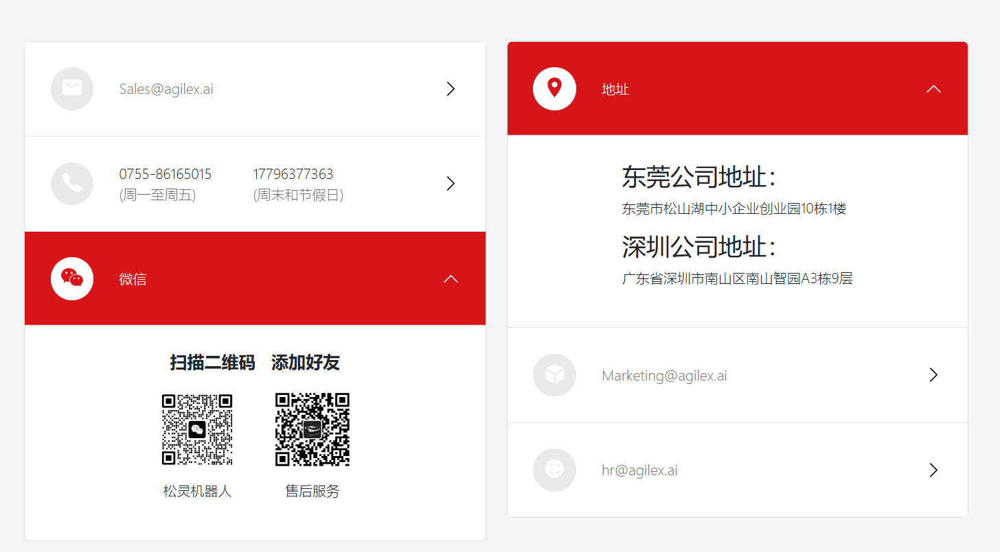

# mobile-aloha

## 1. Environment Setup

1. Download the cobot-magic project:
~~~bash
git clone https://github.com/agilexrobotics/cobot_magic.git
~~~

2. Compile:
~~~bash
cd cobot_magic/remote_control
./tools/build.sh

cd cobot_magic/camera_ws
catkin_make
~~~

## 2. Testing

~~~bash
# 1. Setup rule
ls /dev/ttyACM*

udevadm info -a -n /dev/ttyACM* | grep serial -m 1

sudo vim /etc/udev/rules.d/arx_can.rules

sudo udevadm control --reload && sudo udevadm trigger

# 2. Start remote arm
cd remote_control
./tools/can.sh

cd master1

source devel/setup.bash

roslaunch arm_control arx5v.launch
~~~

## 3. Data Collection

~~~bash
# 1. Start roscore
roscore

# 2. Start the robotic arm and camera
./tools/remote.sh

# 3. Collect data
python collect_data.py --max_timesteps 500 --dataset_dir ./data --episode_idx 0
~~~

## 4. Model Training and Inference

~~~bash
# 1. Activate virtual environment
conda activate aloha

# 2. Training
python act/train.py --dataset_dir ~/data0314/ --ckpt_dir ~/train0314/ --batch_size 4 --num_epochs 3000

# 3. Inference
## 3.1 Start the secondary arm only
cd remote_control
./tools/puppet.sh

## 3.2 Start inference code
python act/inference.py --ckpt_dir ~/train0314/
~~~

---

# Contact Us

